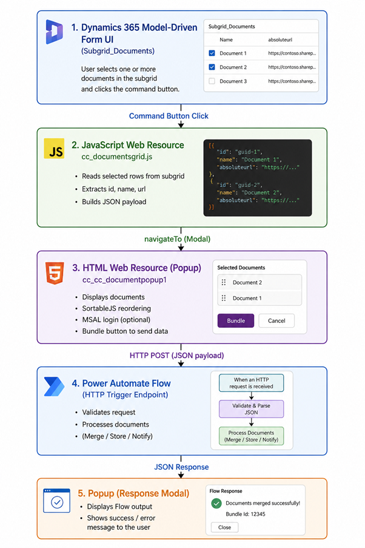
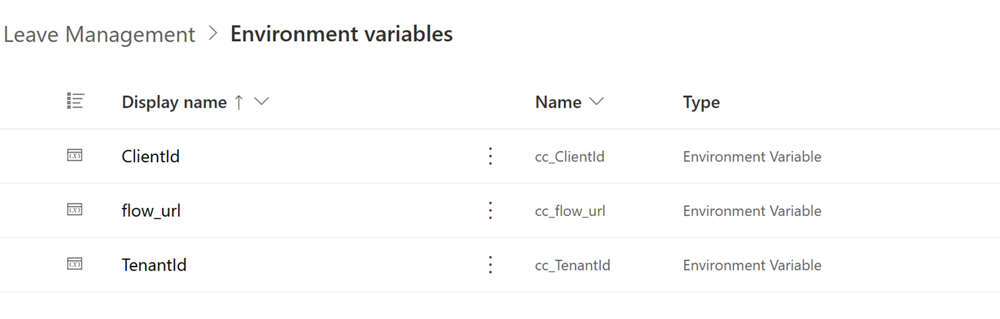
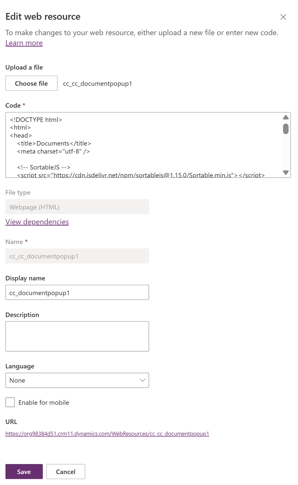
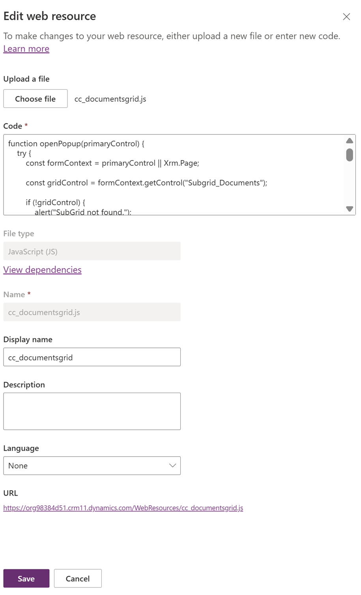
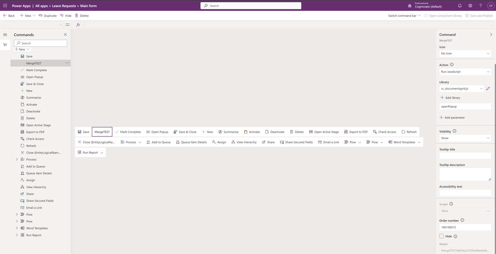

# Call Power Automate from a Command Button in Model-Driven Apps / Dynamics 365


A JavaScript library for triggering Power Automate flows directly from Dynamics 365 ribbon / command bar buttons. Designed as a modern, ALM-ready replacement for Ribbon Workbench / Smart Buttons functionality.

## Preview

> 📹 *(Video walkthrough coming soon)*

---

## Features

- **Authenticated flow trigger** — calls Power Automate as the signed-in user, not as *Anyone with the link*.
- **MSAL integration** — dynamically loads `msal-browser` at runtime and acquires an access token before invoking the flow.
- **Drag-to-reorder popup** — a modal rendered via an HTML Web Resource lets users reorder selected documents using SortableJS before sending.
- **Blocking loading overlay** — a full-screen spinner prevents accidental interaction while the flow is running.
- **Result dialog** — the Flow response (success message, Bundle ID) is displayed inside the popup on completion.
- **ALM-ready solution** — environment variables (`ClientId`, `TenantId`, `flow_url`) keep configuration out of code.
- **Practical use-case included** — select and merge documents from a Dynamics subgrid.

---

## How It Works

```
User selects documents in subgrid
  → clicks Bundle button (Command)
  → cc_documentsgrid.js collects selected rows
  → opens cc_cc_documentpopup1 as a modal (navigateTo)
  → user reorders documents (SortableJS)
  → clicks Bundle
  → popup POSTs JSON payload to Power Automate
  → Flow processes documents (Merge / Store / Notify)
  → JSON response returned and shown in modal
```

---

## Architecture



| Step | Component | Description |
| --- | --- | --- |
| 1 | **Dynamics 365 Model-Driven Form UI** | User selects one or more documents in `Subgrid_Documents` and clicks the command button. |
| 2 | **JavaScript Web Resource** `cc_documentsgrid.js` | Reads selected rows, extracts `id`, `name`, `absoluteurl`, and builds a JSON payload. |
| 3 | **HTML Web Resource / Popup** `cc_cc_documentpopup1` | Displays documents, allows drag-to-reorder, authenticates with MSAL, and sends data. |
| 4 | **Power Automate Flow** (HTTP Trigger) | Validates the request, parses JSON, and processes the documents. |
| 5 | **Popup Response Modal** | Displays the Flow output (success message, Bundle ID, or error) to the user. |

---

## Prerequisites

| Requirement | Details |
| --- | --- |
| Azure App Registration | SPA type, redirect URI set to your Dynamics 365 URL |
| Token settings | Access Tokens, ID Tokens, and Public Client Flows all enabled |
| API permission | Microsoft Graph `User.Read` with admin consent granted |
| Power Automate trigger | Configured as "Anyone with the link" (MSAL handles identity validation) |
| Flow input schema | JSON schema defined on the HTTP trigger for incoming document data |

---

## Environment Variables

Environment variables keep credentials and URLs outside of code and make the solution fully ALM-ready.

**Create each variable:** `Solution → New → More → Environment Variable`

| Display Name | Schema Name | Type | Purpose |
| --- | --- | --- | --- |
| ClientId | `cc_ClientId` | Text | Azure App Registration client ID |
| TenantId | `cc_TenantId` | Text | Azure AD tenant ID |
| flow_url | `cc_flow_url` | Text | Power Automate HTTP trigger URL |

> After creating each variable, set a **Current Value** and **Publish** the solution.



---

## Web Resources

This solution uses two Web Resources that work together.

### 1. HTML Web Resource — `cc_cc_documentpopup1`

> Full source: [cc_cc_documentpopup1.html](cc_cc_documentpopup1.html)

**Create it:** `Solution → New → Web Resource → HTML (Webpage)`

Set the **Name (schema)** and **Display Name**, paste or upload your HTML code, then **Save and Publish**.



**What it does:**

- Displays selected SharePoint documents from Dynamics in a modal popup.
- Parses document data (`id`, `name`, `absoluteurl`) passed via query string.
- Renders a draggable list using **SortableJS** for reordering.
- Retrieves environment variables via `Xrm.WebApi`.
- Authenticates users using **MSAL** (`msal-browser` library), loaded dynamically at runtime.
- Acquires an access token and POSTs a JSON payload to the Power Automate flow via HTTP.
- Shows a full-screen blocking overlay with a spinner during processing.
- Displays the Flow response in a modal within the popup.
- Provides **Bundle** (execute flow) and **Cancel** (close dialog) actions.

**Reading environment variables from Dataverse:**

```javascript
async function getEnv(name) {
    const query = "?$filter=schemaname eq '" + name + "'" +
                  "&$select=defaultvalue" +
                  "&$expand=environmentvariabledefinition_environmentvariablevalue($select=value)";

    const result = await parent.Xrm.WebApi.retrieveMultipleRecords(
        "environmentvariabledefinition", query
    );

    const env = result.entities[0];
    return env.environmentvariabledefinition_environmentvariablevalue?.[0]?.value
        || env.defaultvalue;
}
```

**Acquiring a token and calling the flow:**

```javascript
async function getToken() {
    await loadMsal(); // dynamically injects msal-browser from CDN

    if (!msalInstance) {
        msalInstance = new msal.PublicClientApplication({
            auth: {
                clientId: await getEnv("cc_ClientId"),
                authority: "https://login.microsoftonline.com/" + await getEnv("cc_TenantId"),
                redirectUri: window.location.origin
            }
        });
    }

    // silent first, popup fallback
    try {
        return (await msalInstance.acquireTokenSilent({
            scopes: ["https://service.flow.microsoft.com//.default"],
            account: msalInstance.getAllAccounts()[0]
        })).accessToken;
    } catch {
        return (await msalInstance.acquireTokenPopup({
            scopes: ["https://service.flow.microsoft.com//.default"]
        })).accessToken;
    }
}

async function callFlow() {
    const token = await getToken();
    const flowUrl = await getEnv("cc_flow_url");

    const response = await fetch(flowUrl, {
        method: "POST",
        headers: {
            "Authorization": "Bearer " + token,
            "Content-Type": "application/json"
        },
        body: JSON.stringify({ documents: items })
    });

    showResponse(await response.json());
}
```

---

### 2. JavaScript Web Resource — `cc_documentsgrid.js`

> Full source: [cc_documentsgrid.js](cc_documentsgrid.js)

**Steps to configure:**

1. Upload the JS file as a Web Resource and publish it.
2. Add it to the **form libraries** and create a **Command button** calling `openPopup` with `PrimaryControl`.
3. Ensure the form has a subgrid named **`Subgrid_Documents`** and the popup web resource (`cc_cc_documentpopup1`) exists.



**What it does:**

- Retrieves the form context using `primaryControl` (with fallback to `Xrm.Page`).
- Accesses the `Subgrid_Documents` control from the form.
- Validates that the subgrid exists and is fully loaded.
- Fetches only the **user-selected rows** from the grid.
- Ensures at least one document is selected before proceeding.
- Extracts `id`, `name`, and `absoluteurl` from each selected row.
- Opens the HTML Web Resource as a **modal dialog** via `Xrm.Navigation.navigateTo`.

**Collecting selected rows and opening the popup:**

```javascript
function openPopup(primaryControl) {
    const formContext = primaryControl || Xrm.Page;
    const rows = formContext.getControl("Subgrid_Documents").getGrid().getSelectedRows();

    let items = [];
    rows.forEach(function (row) {
        const entity = row.getData().getEntity();
        const attr = entity.attributes.getByName("absoluteurl");
        items.push({
            id: entity.getId(),
            name: entity.getPrimaryAttributeValue(),
            absoluteurl: attr ? attr.getValue() : null
        });
    });

    Xrm.Navigation.navigateTo(
        {
            pageType: "webresource",
            webresourceName: "cc_cc_documentpopup1",
            data: JSON.stringify(items)
        },
        { target: 2, width: { value: 600, unit: "px" }, height: { value: 400, unit: "px" }, position: 1 }
    );
}
```

---

## Payload Sent to the Flow

The popup POSTs the following JSON structure to the Power Automate HTTP trigger URL:

```json
{
  "documents": [
    {
      "id": "guid-1",
      "name": "Document 1",
      "absoluteurl": "https://contoso.sharepoint.com/..."
    },
    {
      "id": "guid-2",
      "name": "Document 2",
      "absoluteurl": "https://contoso.sharepoint.com/..."
    }
  ]
}
```

The array is **ordered** — it reflects the sequence the user set in the drag-to-reorder dialog.

---

## Power Automate Flow — Setup

1. Configure the trigger as **"When an HTTP request is received"**.
2. Add a JSON schema to the trigger that matches the document payload above.
3. Validate the user identity inside the Flow before processing.
4. Process the documents (merge, store, notify, etc.).
5. Return a JSON response body — the popup will display this to the user.

---

## Configure the Command Ribbon

1. Open **Main Form → Command bar editor** and create a new command (e.g. `MergeTEST`).
2. Set **Action = Run JavaScript** and select your library (`cc_documentsgrid.js`).
3. Enter the function name: `openPopup`.
4. Add a parameter → **`PrimaryControl`** (this passes the form context).
5. Set **Scope = Table (Main Form)** and ensure **Visibility = Show**.
6. **Save and Publish** the form to make the command available.



---

## Security Model

The solution uses MSAL authentication to ensure only authenticated users from the configured tenant can trigger the Power Automate flow. Since the flow is restricted to *"Any user in my tenant"*, anonymous access is not permitted.

The access token proves the user's identity and tenant membership before the flow executes — providing a controlled, secure approach where only signed-in organisational users can submit document bundle requests.

---

## Solution

| Solution | Author |
| --- | --- |
| Dynamics 365 Web Resource — Power Automate Command Trigger | Clavin Fernandes |

## Version History

| Version | Date | Comments |
| --- | --- | --- |
| 1.0.0 | May 2026 | Initial release |

---

## References

- [Blog: Execute Power Automate from SPFx (not as anyone)](https://cognicoast.com/blogs/Execute%20Power%20Automate%20workflow%20from%20SPFx%20NOT%20as%20Anyone.html)
- [SPFx Merge Documents — sister repository](https://github.com/cfernandes-muhimbi/spfx-merge-documents)
- [Microsoft Docs: Xrm.Navigation.navigateTo](https://learn.microsoft.com/en-us/power-apps/developer/model-driven-apps/clientapi/reference/xrm-navigation/navigateto)
- [Microsoft Docs: Xrm.WebApi](https://learn.microsoft.com/en-us/power-apps/developer/model-driven-apps/clientapi/reference/xrm-webapi)
- [MSAL Browser library](https://github.com/AzureAD/microsoft-authentication-library-for-js/tree/dev/lib/msal-browser)
- [SortableJS](https://github.com/SortableJS/Sortable)
